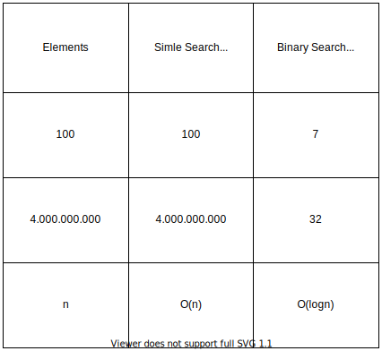

## Data Structures & Algorithms №2  
#### First Algorithms & Complexity
<br/>


## 1. Convert Decimal to Binary


what a number 11 ?


```python
# weite here code with students
```


```python
def binary(num):
    s = ''
    while num > 0:
        s = f'{num % 2}{s}'
        num //= 2
    return s

while True:
    n = int(input('Enter number: '))
    if n != 0:
        print(binary(n))
    else:
        break
```

## 2. Sieve Of Eratosthenes


#### Sieve Of Eratosthenes Animation (from wikipedia)


```python
n = int(input('Enter nuber: '))
sieve = [i for i in range(n)]
sieve[1] = 0

for i in range(2, n):
    if sieve[i] != 0:
        j = i * 2
        while j < n:
            sieve[j] = 0
            j += i
result = [i for i in sieve if i != 0]

print(result)
```

### 3. Algorithms complexity O(n)


```python
def sum_one(n):
    sum_numbers = 0
    for i in range(1, n+1):
        sum_numbers += 1
    return sum_numbers
```


```python
def sum_two(n):
    sum_numbers = (n * (n + 1)) / 2
    return sum_numbers
```


```python
from timeit import Timer


t = Timer("sum_one(10000)", "from __main__ import sum_one")
print('{0:.6f}'.format(t.timeit(number=10)))

t = Timer("sum_one(100000)", "from __main__ import sum_one")
print('{0:.6f}'.format(t.timeit(number=10)))

t = Timer("sum_one(1000000)", "from __main__ import sum_one")
print('{0:.6f}'.format(t.timeit(number=10)), end="\n\n")


# t = Timer("sum_two(10000)", "from __main__ import sum_two")
# print('{0:.6f}'.format(t.timeit(number=10)))

# t = Timer("sum_two(100000)", "from __main__ import sum_two")
# print('{0:.6f}'.format(t.timeit(number=10)))

# t = Timer("sum_two(1000000)", "from __main__ import sum_two")
# print('{0:.6f}'.format(t.timeit(number=10)))
```

#### Binary Search Complexity



# Homework №2

```

	1.Ինչ կլինի algorithm-ի բարդությունը
	
		1.1 Հեռախոսային գրքույկում ցանկանում ենք գտնել ազգանունը 
        և ունենք հեռախոսահամարը:
		
		1.2 Հեռախոսային գրքույկում ցանկանում ենք գտնել հեռախոսահամարը
        և ունենք ազգանունը:


	2.Գրեք Euclid-ի algorithm-ը (research-ից հետո) 
		
		2.1 Diagram
		
		2.2 Pseudocode
		
		2.3 Code
		
	3.Գրեք ծրագիր որը Binary number-ը կդարձնի Decimal:
```

### Research
```
	1.	Euclid-ի algorithm-ը
```
