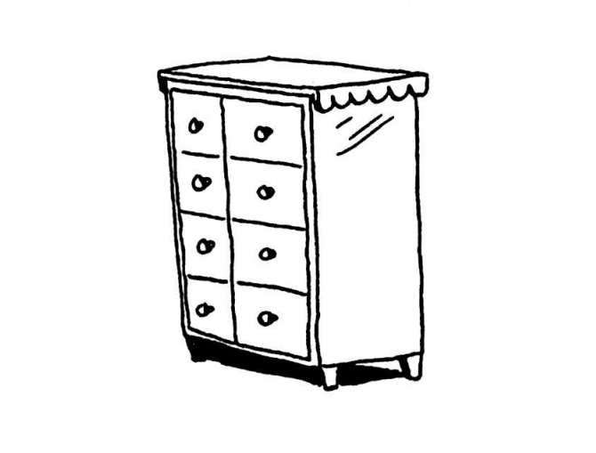
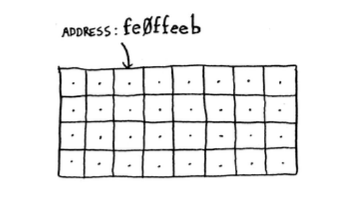
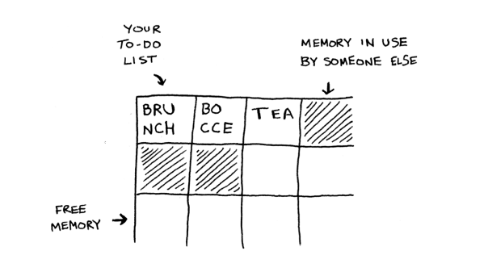
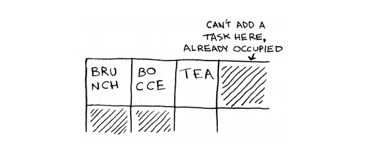
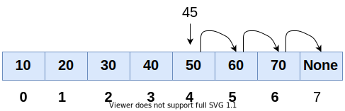
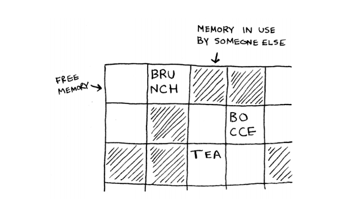
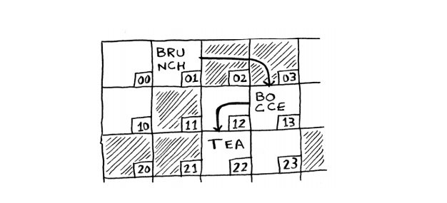

## Data Structures & Algorithms №3  
#### Basic Data Structures
<br/>


## 1. Arrays (Nor Norker)

#### How memory works














## 2. Linked Lists






#### Complexity


```python
# Write code with students
```


```python
class Node:
    def __init__(self, data):
        self.__data = data
        self.__next = None
        
    def set_data(self, data):
        self.__data = data
        
    def get_data(self):
        return self.__data
    
    def set_next(self, node):
        self.__next = node
        
    def get_next(self):
        return self.__next
```


```python
class LinkedList:
    def __init__(self):
        self.__head = None
        
    def is_empty(self):
        return self.__head is None
    
    def add(self, item):
        node = Node(item)
        node.set_next(self.__head)
        self.__head = node
        
    def __str__(self):
        if self.__head is None:
            return '[]'
        current = self.__head
        data = str(current.get_data())
        while not current.get_next() is None:
            current = current.get_next()
            data += ", " + str(current.get_data())
        return data

```


```python
my_list = LinkedList()
my_list.is_empty()
my_list.add(1)
my_list.add(5)
my_list.add(75)
# my_list.add(95)
# my_list.is_empty()
print(my_list)
```

    75, 5, 1
    

# Homework №3
```
    1.  Ինչ data structure կօգտագործեք՝ Linked List թե Array:
        
        1.1 Ամեն օր գրում եք ձեր ծախսերը և ամսվա վերջում հաշվում։
        
        1.2 Հաճախորդները ավելացնում են պատվերներ իսկ խոհարարը
        հերթով վերցնում և կատարում։
    
	2.  Գրեք Linked List որը կունենա հետեվյալ method-ները։
        
        2.1 size - վերադարձնում է item-ների քանակը
        
        2.2 remove - ջնջում է առաջին արաջին հանդիպած տվյալ item-ը

        2.3 __str__ - Linked List-ը տպում է list-ի նման

        2.4 search - փնտրում է item-ը

        2.5 __iter__, __next__ - Linked List֊ը դարձնել itarable
```

### Research
```
	1.	Dynamic Array
```
