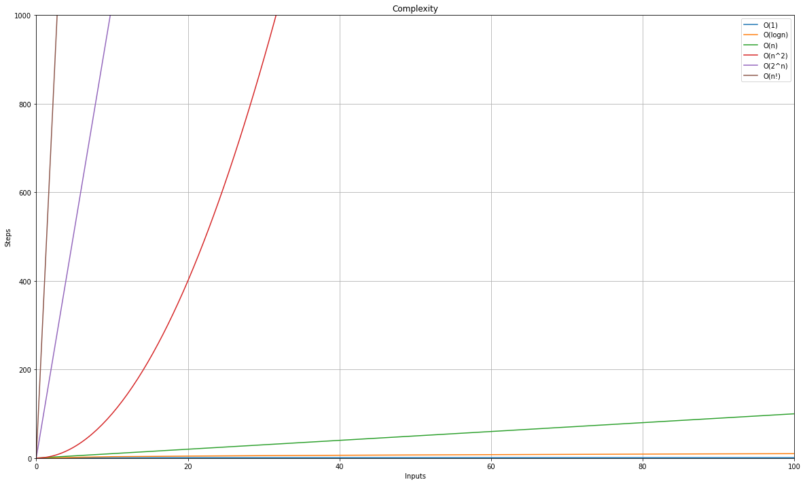
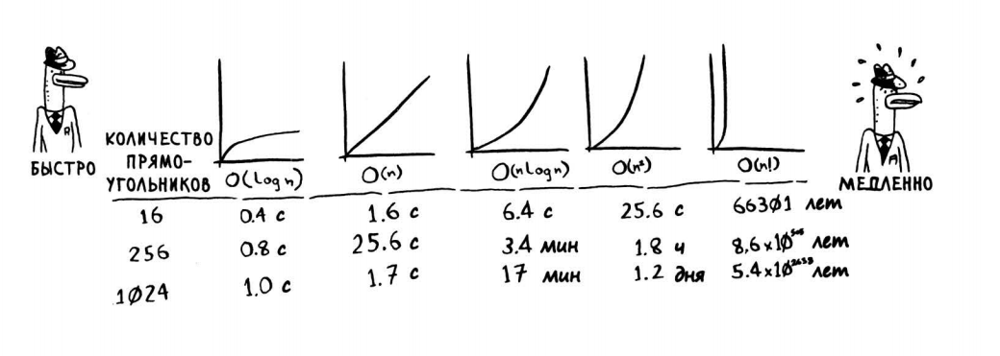

## Data Structures & Algorithms №4  
#### Numeral Systems, Big O, Sort Algorithms Part 1
<br/>


## 1. Numeral Systems


```python
# 2

print(0b1010)
print(bin(12))
print(int('101', 2))
```


```python
# 8

print(0o1170)
print(oct(12))
print(int('101', 8))
```


```python
# 16

print(0xF)
print(hex(35))
print(int('F1', 16))
```

## 2. Big O


```python
import matplotlib.pyplot as plt
import numpy as np
import math
from scipy.interpolate import make_interp_spline, BSpline

x_list = [0, 10, 20, 30, 40, 50, 60, 70, 80, 90, 100]
x1 = np.array(x_list.copy())
y1 = np.array([0, 1, 1, 1, 1, 1, 1, 1, 1, 1, 1])

x2 = np.array(x_list.copy())
y2 = [math.sqrt(i) for i in [0, 10, 20, 30, 40, 50, 60, 70, 80, 90, 100]]

x3 = np.array(x_list.copy())
y3 = [0, 10, 20, 30, 40, 50, 60, 70, 80, 90, 100]

x4 = np.array(x_list.copy())
y4 = np.array([0, 100, 400, 900, 1600, 2500, 3600, 4900, 5600, 8100, 10000])
xnew = np.linspace(x4.min(), x4.max(), 300)  

spl = make_interp_spline(x4, y4, k=3)
power_smooth = spl(xnew)

x5 = np.array([0, 10, 20, 30])
y5 = [0, 1024, 1048, 107374]

x6 = np.array([0, 10, 20])
y6 = [0, 3628, 243290200]
```


```python
def create_graph():
    fig, ax = plt.subplots()
    fig.set_size_inches(20, 12)
    
    ax.set_ylim(0, 1000)
    ax.set_xlim(0, 100)
    ax.plot(x1, y1, label='O(1)')
    ax.plot(x2, y2, label='O(logn)')
    ax.plot(x3, y3, label='O(n)')
    ax.plot(xnew,power_smooth, label='O(n^2)')
    ax.plot(x5, y5, label='O(2^n)')
    ax.plot(x6, y6, label='O(n!)')
    
    plt.xlabel('Inputs')
    plt.ylabel('Steps')
    plt.title('Complexity')
    ax.legend()
    ax.grid(True)
    
    return plt
```


```python
plt = create_graph()
plt.show()
```


    

    




## 3. Bubble Sort


```python
# Write code with students
```


```python
import random
lst = [i for i in range(10)]
random.shuffle(lst)
print(lst)
```


```python
def bubble_sort(lst):
    for cnt in range(1, len(lst)):
        for i in range(len(lst) - cnt):
            if lst[i] > lst[i+1]:
                lst[i], lst[i+1] = lst[i+1], lst[i]
    return lst
print(bubble_sort(lst))
```

# Homework №4
```
    1.Ինչքան է Bubble Sort-ի Complexity-ն:
	
	2.Տրված [4, 2, 6, 7, 7] list-ը քանի փոխելու գործողությամբ 
    կսորտավորի Bubble Sort-ը:
	
	3.Գրել Bubble Sort-ի pseudocode-ը:
	
	4.Գրել function որը կախված ընդունած parameter-երից Bubble Sort-ի
    միջոցով կսորտավորի list-ը աճման կամ նվազման կարգով: 
```
### Research
```
	1.Ինչ algorithm է օգտագործում python-ի list-ի sort() method-ը: 
```
