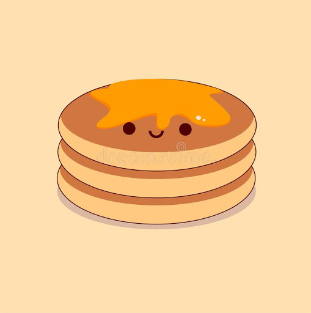

## Data Structures & Algorithms №5  
#### Recursion, Stack, Sort Algorithms Part 2
<br/>


## 1. Stack




```python
# Write simple stack with students
```

## 2. Recursion

#### 1. Base Case

#### 2. General Case

#### 3. Before and After Recursion Case


```python
# main_box = [[], [], [["sarafan"], [], ["key"]], []]

# def look_for_key(main_box):
#     i = 0
#     while main_box != []:
#         box = main_box[i] 
#         print(i)
#         for item in box:
#             if item == "key":
#                 print("key found")
#             elif isinstance(item, list):
#                 main_box.append(item)
                
#         main_box.pop(i)
        
# look_for_key(main_box)   
```


```python
# main_box = [[], [], [[], ["sarafan"], ["key"]], []]

# def look_for_key(main_box):   
#     for item in main_box:
#         if item == "key":
#             print("key found")
        
#         elif isinstance(item, list) and item:
#             look_for_key(item)
        
# look_for_key(main_box)
```


```python
# def func1(x):
#     print("before recursion", x)
    
#     if x >= 10:
#         return
#     else:
#         func1(x + 1)
#     print("after recursion", x)

# func1(0)
```

## 3. Selection Sort


```python
# Write code with students
```


```python
import random

size = 10 
lst = [i for i in range(size)]
random.shuffle(lst)
print(lst)

def find_smallest(lst):
    smallest = lst[0]
    smallest_index = 0
    for i in range(1, len(lst)):
        if lst[i] < smallest:
            smallest = lst[i]
            smallest_index = i 
    return smallest_index

def selection_sort(lst):
    new_lst = []
    for i in range(len(lst)):
        smallest = find_smallest(lst)
        new_lst.append(lst.pop(smallest))
    return new_lst

print(selection_sort(lst))
```


```python
import random

size = 10 
lst = [i for i in range(size)]
random.shuffle(lst)
print(lst)

def selection_sort(lst):
    for i in range(len(lst)):
        index_min = i
        
        for j in range(i + 1, len(lst)):
            if lst[j] < lst[index_min]:
                index_min = j
                
        lst[index_min], lst[i] = lst[i], lst[index_min]

selection_sort(lst)
print(lst)
```

# Homework №5

```
    1.  Ինչ ընդունված կանոնի պետք է հետեվեք անվերջ ռեկուրսիայից
    խուսափելու համար։

    2.  Ինչ error եք ստանում անվերջ ռեկուրսիայի դեպքում։

    3․  Ինչ կտպի հետեվյալ կոդը։
        m = Stack()
        m.push('x')
        m.push('y')
        m.pop()
        m.push('z')
        print(m.peek())
    
    4.  Ստուգեք բալանսավորված են արդյոք տրված string-ում փակագծերը։
        
        Օրինակ       
            Input : {[]{()}}
            Output : Balanced
    
            Input : [{}{}(]
            Output : Unbalanced  

    5.  Սորտավորեք տրված list-ը ըստ լսումների քանակի selection sort-ի
    միջոցով։
        
        [
            {'name' : 'Aram Asatryan', 'count' : 5000},
            {'name' : 'Oxxxymiron', 'count' : 2},
            {'name' : 'Guf', 'count' : 300},
            {'name' : 'Snoop dog', 'count' : 153},
            {'name' : '50 Cent', 'count' : 50},
            {'name' : 'Pink Floyd', 'count' : 2000},
            {'name' : 'Misho', 'count' : 6000},
            {'name' : 'Gunther', 'count' : 69000000}
        ]
```

### Research
```
	1.  Ինչքան է python-ում մաքսիմում ռեկուրսիայի քանակը և ինչպես 
    կարող ենք փոխել այն։
```
