## Data Structures & Algorithms №6  
#### Divide & Conquer,  Sort Algorithms Part 3
<br/>
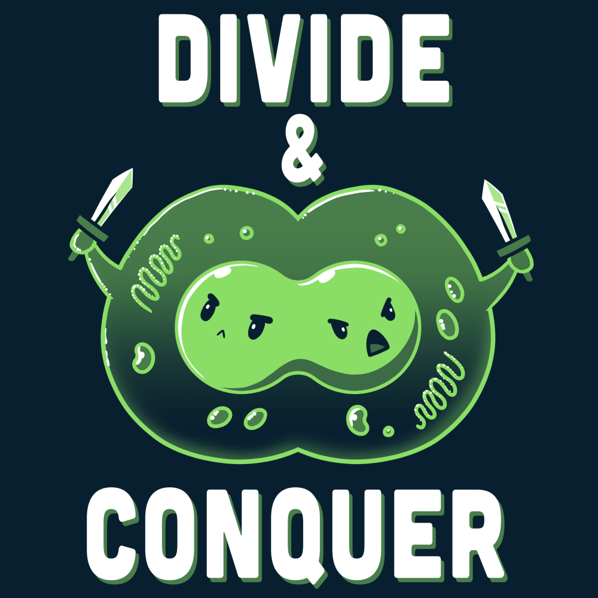

## 1. Divide & Conquer

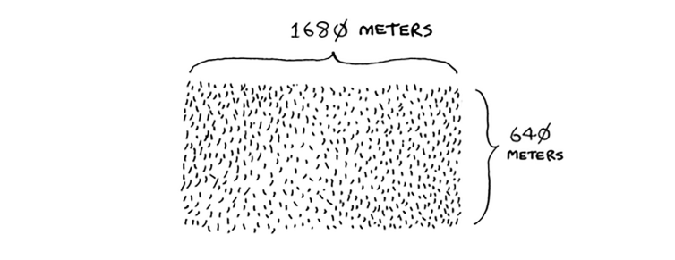

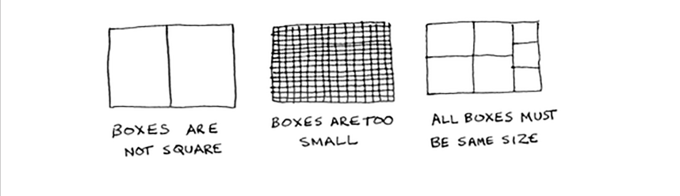

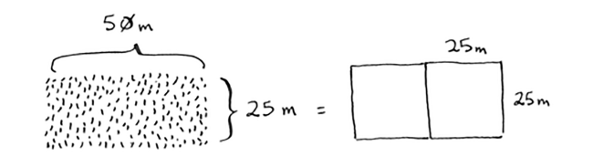

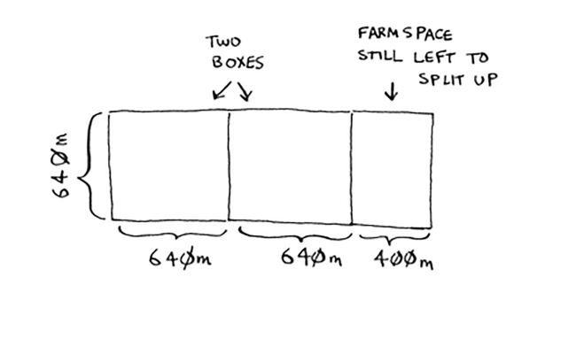

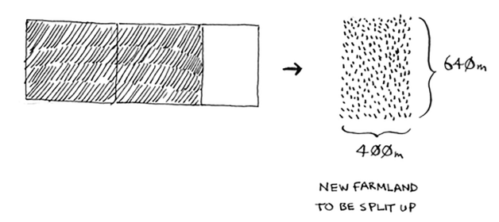

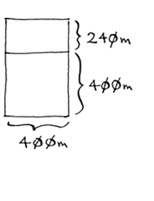

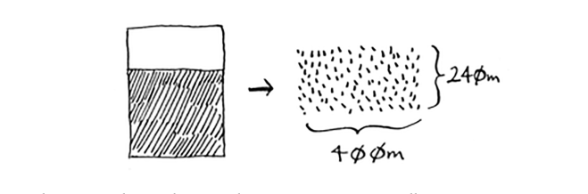

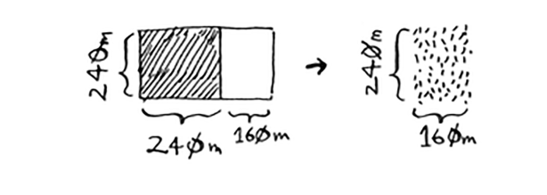

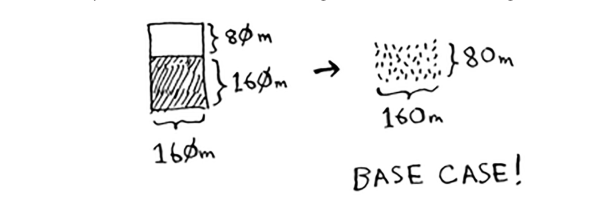


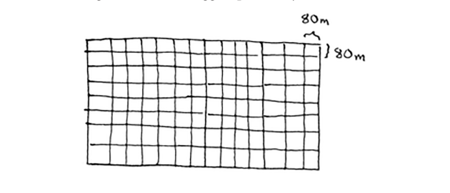

### euclidean algorithm


```python
def find_square(a, b):
    if b == 0:
        return a
    return f1(b, a % b)
```

## 2. Quick Sort

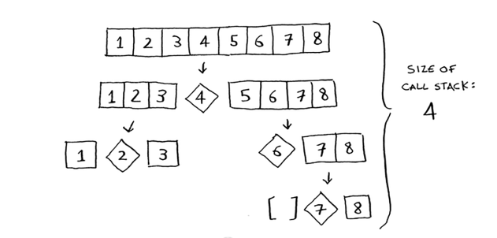

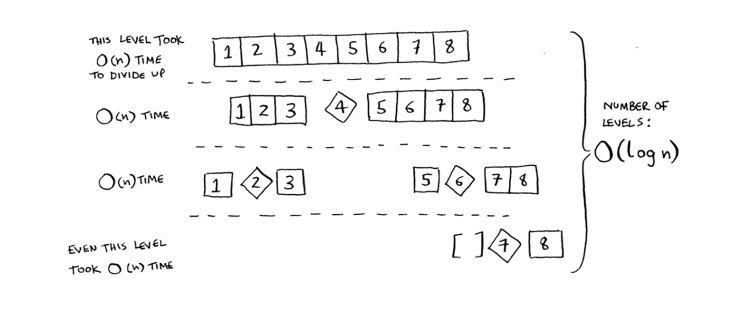

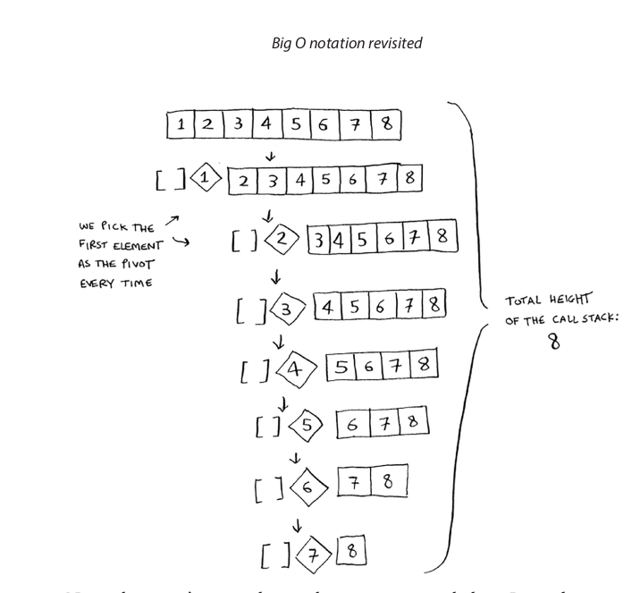


```python
# write code with students
```


```python
import random

size = 10 
lst = [i for i in range(size)]
random.shuffle(lst)
print(lst)

def quick_sort(array):
    if len(array) <= 1:
        return array
    pivot = random.choice(array)
    s_ar = []
    m_ar = []
    l_ar = []
    for item in array:
        if item < pivot:
            s_ar.append(item)
        elif item > pivot:
            l_ar.append(item)
        elif item == pivot:
            m_ar.append(item)
    return quick_sort(s_ar) + m_ar + quick_sort(l_ar)

quick_sort(lst)
```

    [5, 1, 9, 4, 2, 6, 8, 3, 0, 7]
    


    [0, 1, 2, 3, 4, 5, 6, 7, 8, 9]


## 3. Merge Sort


```python
# import random

# size = 10 
# lst = [i for i in range(size)]
# random.shuffle(lst)
# print(lst)
```


```python
# def mergeSort(arr):
#     if len(arr) > 1:
#         mid = len(arr)//2
#         L = arr[:mid]
#         R = arr[mid:]
#         mergeSort(L)
#         mergeSort(R)
#         i = j = k = 0
#         while i < len(L) and j < len(R):
#             if L[i] < R[j]:
#                 arr[k] = L[i]
#                 i += 1
#             else:
#                 arr[k] = R[j]
#                 j += 1
#             k += 1
#         while i < len(L):
#             arr[k] = L[i]
#             i += 1
#             k += 1
#         while j < len(R):
#             arr[k] = R[j]
#             j += 1
#             k += 1
# mergeSort(lst)
# print(lst)
```

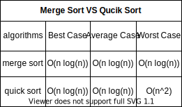

# Homework №6

```
    1.  Ինչ կլինի complexity֊ին 1-10 թվերի բազմապատկման աղյուսակը
    գրելու համար։

    2.  Գրեք recursive function որը կհաշվի list-ի item-ների գումարը։ 
    
    3.  Գրեք recursive function որը կհաշվի list-ի item-ների քանակը։ 
    
    4.  Ստեղծեք 100, 10000 և 1000000 item-ներ ունեցող list-եր որոնք
    կլինեն random դասավորված
        
        4.1 Սորտավորեք list-երը quick sort-ի և merge sort-ի 
        օգնությամբ timeit module-ի միջոցով ստուգեք յուրաքանչյուրի
        արագությունը։
        
        4.2 Ստուգեք յուրաքանչյուրի արագությունը արդեն սորտավորված 
        list-երի դեպքում։
        
        4.3 Ներկայացրեք table ստացած տվյալներով։    
```

### Research
```
    1.  timeit module
```
