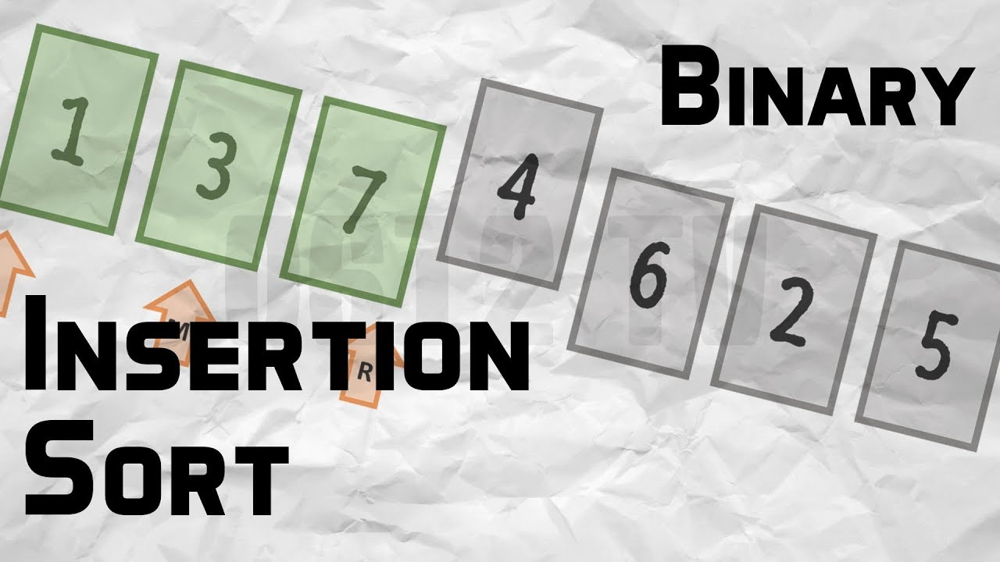
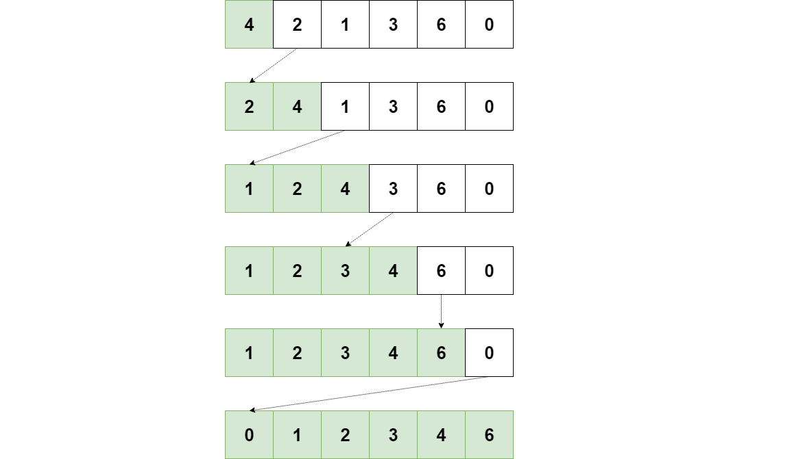

## Data Structures & Algorithms №7  
#### Sort Algorithms Part 4
<br/>


## 1. Insertion Sort


```python
# Write simple stack with students
# lst = [2, 1, 6, 7, 3]

# def insertion_sort(lst):
#     for i in range(1, len(lst)):
#         item = lst[i]
#         while item < lst[i-1] and i > 0:
#             lst[i] = lst[i-1]
#             i -= 1
#         print(lst)
#         lst[i] = item
    
# insertion_sort(lst)
# print(lst)
```


```python
def insertionSort(arr):
     for i in range(1, len(arr)): 
        key = arr[i] 
        j = i
        
        while j > 0 and key < arr[j-1] : 
            arr[j] = arr[j-1] 
            j -= 1
        arr[j] = key
            
arr = [12, 13, 1, 111, 5, 6, 25]
insertionSort(arr)
print(arr)
```

## 2. Binary Insertion Sort




```python
def integer_test_insertion_binary_sort_success():
    integers_list = [1, 4, 3, 2, 5]
    expected_result = [1, 2, 3, 4, 5]
    result = insertion_binary_sort(integers_list)
    message = "Test pass OK"

    if result != expected_result:
        message = f"Test fail {expected_result} != {result}"

    print(message)


test_insertion_binary_sort_success()
```


    ---------------------------------------------------------------------------

    NameError                                 Traceback (most recent call last)

    <ipython-input-7-7c873bb3ecdc> in <module>
         11 
         12 
    ---> 13 test_insertion_binary_sort_success()
    

    NameError: name 'test_insertion_binary_sort_success' is not defined


```python
def binary_search(arr, val, start, end):
    if start == end:
        if arr[start] > val:
            return start
        else:
            return start + 1

    if start > end:
        return start

    mid = (start + end) // 2
    if arr[mid] < val:
        return binary_search(arr, val, mid + 1, end)
    elif arr[mid] > val:
        return binary_search(arr, val, start, mid - 1)
    else:
        return mid


def insertion_binary_sort(arr):
    for i in range(1, len(arr)):
        val = arr[i]
        j = binary_search(arr, val, 0, i - 1)  # Use binary search for already sorted array
        arr = arr[:j] + [val] + arr[j:i] + arr[i + 1:]
        print(arr)
    return arr

integers_list = [1, 4, 3, 2, 5]
result = insertion_binary_sort(integers_list)
```

# Homework №7

```
    1.  Կարդալ users.txt file-ը, Insertion Sort-ի միջոցով սորտավորել 
    column-ները և գրել նոր file֊ում։
        
    2.  Կարդալ users.txt file-ը, Binary Insertion Sort-ի միջոցով 
    սորտավորել row-ները 
        
        2.1 ըստ age-ի։
        
        2.2 ըստ function-ի parameter-ով ստացած column-ի։
```

### Research
```
    1.   Գտնել Binary Insertion Sort-ի complexity-ն վատագույն, միջին և
    լավագույն case-երում։
```
