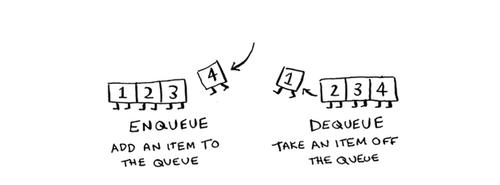
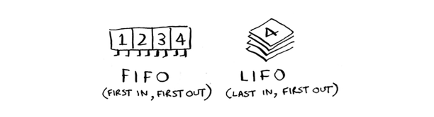
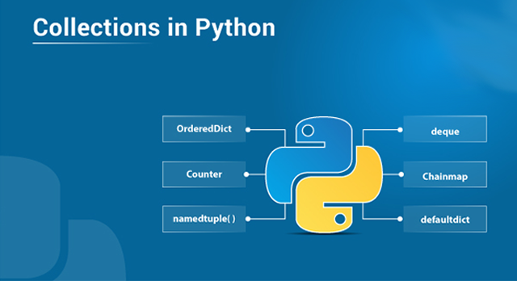
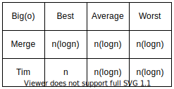

## Data Structures & Algorithms №8  
### Queue, Collections, Timsort 
<br/>


## 1. Queue





## Queue Methods

### 1. enqueue
### 2. dequeue

## 2. Module collections 




```python
from collections import namedtuple

User = namedtuple('User', 'name, age')
user_1 = User('Aren', 23)
user_2 = User('Vardan', 18)
user_3 = User('Armen', 21)


def by_age(user):
    return user.name

users = [user_1, user_2, user_3]


print(sorted(users, key=by_age))
```

    23
    


```python
from collections import Counter

a = ["user", 1, 1, 1, 2, 3, 3, 4, 3, 3, 4]
c = Counter(a)
print(c)
```


```python
from collections import OrderedDict

od = OrderedDict()
od[1] = 'e'
od[2] = 'd'
od[3] = 'u'
od[4] = 'r'
od[5] = 'e'
od[6] = 'k'
od[7] = 'a'
print(od)
```

## 3. Timsort


```python
# # Python3 program to perform basic timSort 
# MIN_MERGE = 32
  
# def calcMinRun(n):
#     r = 0
#     while n >= MIN_MERGE: 
#         r |= n & 1
#         n >>= 1
#     return n + r 
  
# def insertionSort(arr, left, right): 
#     for i in range(left + 1, right + 1): 
#         j = i 
#         while j > left and arr[j] < arr[j - 1]: 
#             arr[j], arr[j - 1] = arr[j - 1], arr[j] 
#             j -= 1
  
# def merge(arr, l, m, r): 
#     len1, len2 = m - l + 1, r - m 
#     left, right = [], [] 
#     for i in range(0, len1): 
#         left.append(arr[l + i]) 
#     for i in range(0, len2): 
#         right.append(arr[m + 1 + i]) 
  
#     i, j, k = 0, 0, l 
    
#     while i < len1 and j < len2: 
#         if left[i] <= right[j]: 
#             arr[k] = left[i] 
#             i += 1
  
#         else: 
#             arr[k] = right[j] 
#             j += 1
  
#         k += 1
    
#     while i < len1: 
#         arr[k] = left[i] 
#         k += 1
#         i += 1
        
#     while j < len2: 
#         arr[k] = right[j] 
#         k += 1
#         j += 1
        
# def timSort(arr): 
#     n = len(arr) 
#     minRun = calcMinRun(n) 
    
#     for start in range(0, n, minRun): 
#         end = min(start + minRun - 1, n - 1) 
#         insertionSort(arr, start, end) 
        
#     size = minRun 
#     while size < n: 
#         for left in range(0, n, 2 * size): 
  
#             # Find ending point of left sub array 
#             # mid+1 is starting point of right sub array 
#             mid = min(n - 1, left + size - 1) 
#             right = min((left + 2 * size - 1), (n - 1)) 
  
#             # Merge sub array arr[left.....mid] & 
#             # arr[mid+1....right] 
#             merge(arr, left, mid, right) 
  
#         size = 2 * size 
    

    
# lst = [1, 5, 9, 7, 3, 7, 4]
# timSort(lst)
# print(lst).
```



# Homework №8
```
    
    1.  FIFO VS LIFO (նշել նաև որ datastructure֊ներն են ռեալիզացնում)։
   
    
    2.  Օգտագործելով list ռեալիզացրեք queue որի միջոցով կկարողանաք հերթականույամբ կանչել տրված 3 function-ները անդադար։
        Առաջադրանքը կատարել research-ի 1֊ին կետը անելուց հետո։
   
    def task1():
        print("function 1 started")
        sleep(2)
        print("function 1 finshed")
    def task2():
        print("function 2 started")
        sleep(2)
        print("function 2 finshed")
    def task3():
        print("function 3 started")
        sleep(2)
        print("function 3 finshed")
    >>> function 1 started
    >>> function 1 finshed
    >>> function 2 started
    >>> function 2 finshed
    >>> function 3 started
    >>> function 3 finshed
    >>> function 1 started
    >>> function 1 finshed
    >>> function 2 started
    >>> ...
    >>> ...
```
### Research
```
    1.   sleep from time
    2.   deque from collections
    3.   Ինչ է := operator֊ը python-ում և որ version-ից սկսած է հասանելի
```
