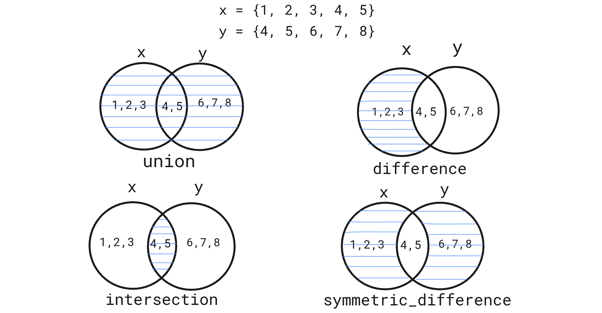

# 6. Set, File

## Chapter 1
### 1. Set introduction
### 2. Set methods
### 3. frozenset


```python
#1. Set introduction

# x = set()
# print(x)
# x = {1, 2, 3, 4, 5}
# y = {4, 5, 6, 7, 8}
# y = {[1, 2, 3, 4, 5]}
# y = set({"key1": "value1", "key2": "value2"})
# print(y)

# y.add(6) # add item in set
# print(y)

# y.remove(6) # remove item from set by value
# print(y)

# y.union(x) 

# y.difference(x) # exist in first and upsent in second

# y.intersection(x)

# y.symmetric_difference() # show all differences

# frozenset

# x = frozenset("123")
# print(x)
# x.add(3)
# x.remove(3)
```



## Chapter 2
### 1. Files introduction (open)
### 2. File read methods
### 3. File write methods


```python
# 1. Files introduction (open)

# f = open("some_file.txt") # default r
# print(f.read())
# f.close()
# file_path = "some_file.txt"
# f = open(file_path, "r")
# print(f.read())
# f.close()

# 'r' # read: for read file
# "a" # append: in end of file if file not exist create new
# "w" # write: open file or create file and
# "x" # create new file, return error if exist
# "r+" read and append

# 2. File read methods

# print(f.read()) # return all file as string
# print(f.readlines()) # return all file as list
# print(f.readline()) # return one line

# 3. File write methods

# file_path = "new_file.txt"
# f = open(file_path, "w")
# f.write("new line\nnew second line") # add new line with string
# f.writelines(["first line", "second line"])
# f.close()
```

    


## Chapter 3
### 1. With context manager
### 2. Code block


```python
# file_path = "some_file.txt"
# with open(file_path) as file: # Use file to refer to the file object
#     print(file.read())
    
# print(file.read()) # error beacause file already closed
```
