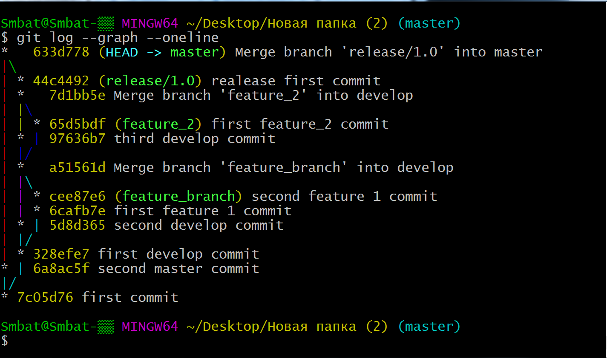

# Homework №10

```
	1.	Ստացիր նկարում տրված graph-ը և push արա նոր repo:
```

```		
	2.	Գտիր միայն Merge արված commit-ները:
		Screenshot արա և նկարը push արա repo:
	
```

```
	3.	Գտիր այն commit-ները որոնք կան master-ում բայց չկան develop-ում հետեվյալ format-ով և գույներով:
		Screenshot արա և և նկարը push արա repo:
```	


### Research
```
	1. git caret vs tilde (^ vs ~)
```
