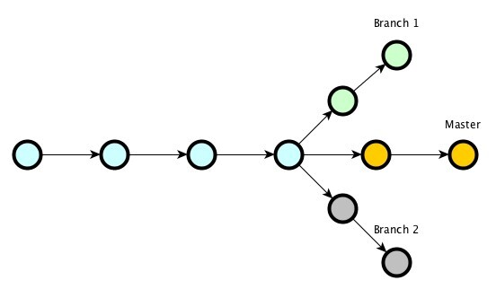
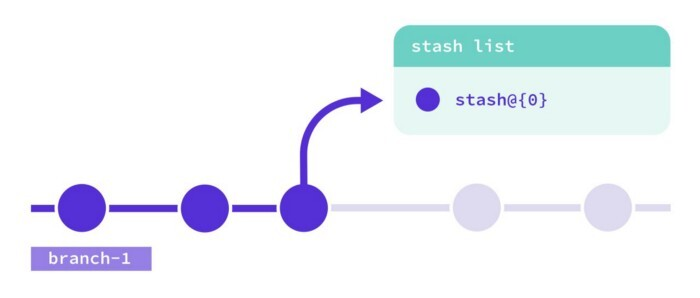

# 4. Local Branching

## 1. Branching

### git branch new_branch
### git checkout new_branch
### or 
### git checkout -b new_branch
### git diff branch_name1..branch_name2
### dev and master

## 2. git stash 

### git stash 
### git stash list
### git stash pop | apply
### git stash clear

## 3. git tag

### git tag tag_name
### git tag -a v1.3
### git tag -a v1.3 -m "my version 1.3"
### git tag
### git tag -a -f v1.3 hash
### git tag -d v1
