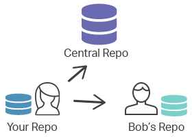

# 6. Remote Basics

## 1. Remote Basics

### Create New Repository
### git remote add origin < origin url >
### git remote -v
### git clone

## 2. fetch, pull, push

### git fetch
### git merge 
### git pull
### git push

### git remote show origin
