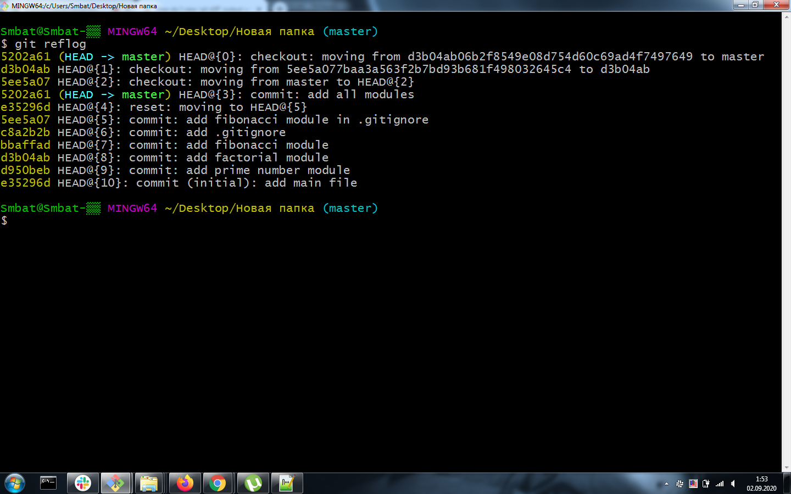

# Homework №3

```
	1.	reflog-ի ու log-ի տարբերությունը:
	
	2.	reset-ի ու checkout-ի տարբերությունը:
	
	3.	git rm-ի ու git rm --cached-ի տարբերությունը:
	
	4.	Ըստ commit-ի message-ների հասկանալ և ավելացնել համապատասխան մոդուլները:

		Բոլոր գործողությունների արդյունքում ստանալ նկարում տրված reflog-ը:
```



### Research
```
	1. git difftool
```


